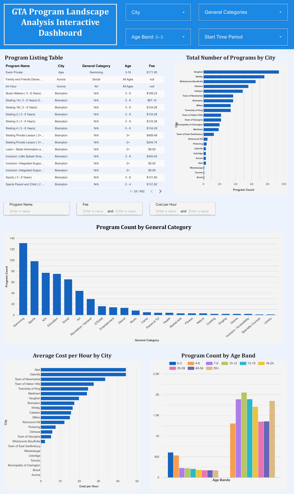

Readme.md

# GTA Program Landscape Analysis
  
**Tools:** Google Sheets, Google Looker Studio  
**Deliverables:** Interactive Dashboard, Executive Summary, Recommendations Report  

---

## 📌 Project Overview

This project analyzes recreation and community program offerings across multiple Greater Toronto Area (GTA) municipalities to identify gaps in availability, pricing trends, and opportunities for future program development.

Using publicly available municipal datasets, our team consolidated fragmented city-level program data into a standardized GTA-wide master dataset. The data was then analyzed and visualized through an interactive dashboard, supported by a one-page executive summary and a detailed recommendations report.

The goal of this project was to demonstrate how data can be transformed into actionable insights to support municipal planning, accessibility, and program design decisions.

---

## 🎯 Business Objective

Municipal recreation programs vary significantly by city, age group, category, pricing, and scheduling. Without a unified analytical view, it is difficult to:

- Identify underserved populations and age groups  
- Compare program supply across municipalities  
- Evaluate pricing consistency and accessibility  
- Optimize program categories and time slots  

This project addresses these challenges by providing a GTA-wide analytical perspective.

---

## 📂 Data Sources

- Publicly available municipal recreation program spreadsheets  
- Cities included: Ajax, Aurora, Brampton, Brock, Burlington, Caledon, Halton Hills, , Milton, Markham, Mississauga, Oakville, Oshawa, Pickering, Uxbridge, Richmond Hills, Toronto, Vaughan, Whitby, and others  
- Raw data fields included:
  - Program name
  - City
  - General category
  - Age range
  - Schedule and session details
  - Program fees

Original city files were preserved as read-only raw data, while cleaned and standardized versions were created separately to maintain data integrity.

---

## 🔄 Project Execution

### 1. Data Collection & Organization

- Collected municipal program datasets from public sources  
- Stored all files in a structured Google Drive environment  
- Created a centralized working file: **GTA_Master_Programs**
- Assigned individual city datasets to team members for parallel cleaning  

---

### 2. Data Cleaning & Standardization

- Designed a common data schema across all municipalities  
- Standardized:
  - City and category naming
  - Age ranges into numeric minimum and maximum values
  - Time formats and session durations  
- Calculated missing metrics such as:
  - Total program duration
  - Cost per hour  
- Documented assumptions using a data dictionary  
- Appended all cleaned datasets into a single master table with source tracking  

---

### 3. Data Quality Assurance

- Identified and addressed missing values and duplicates  
- Flagged implausible entries (e.g., negative ages, extreme pricing)  
- Used filters and conditional formatting to validate calculated fields  
- Finalized the master dataset structure after quality checks  

---

### 4. Exploratory Data Analysis (EDA)

Performed structured analysis using pivot tables and summary tables:

- **Programs by City:** volume and distribution  
- **Programs by Age Band:** availability, average fee, cost per hour  
- **Programs by Category:** common vs niche offerings  
- **Time Slot Analysis:** morning, afternoon, evening distribution  

Key metrics analyzed included:
- Program count  
- Average program fee  
- Average cost per hour  
- Percentage distribution across age groups  

---

### 5. Dashboard Development

Insights were visualized in an interactive **Google Looker Studio dashboard**, featuring:

- Total number of programs by city  
- Program distribution by age band  
- Program count by general category  
- Average cost per hour by city  
- Filterable program listing table  

The dashboard allows users to dynamically filter results by city, age group, category, pricing, and time period.



---
## 📊 Key Insights

- **Program Supply:** Program availability is heavily concentrated in cities such as Whitby, Markham, and Vaughan, while municipalities including Uxbridge, Aurora, and East Gwillimbury are significantly underserved.

- **Age Gaps:** Children aged **0–3** represent the most underserved group, accounting for only **11.76%** of total program offerings across the GTA.

- **Category Concentration:** Program offerings are dominated by **Sports** and **Swimming**, with limited availability in niche and enrichment categories such as Chess, Singing, and Parent & Tot programs.

- **Pricing Variation:** The GTA-wide average program fee is **$115.88**, with substantial variation across municipalities, indicating differences in affordability and market positioning.

- **Scheduling Patterns:** Afternoon time slots are consistently underutilized compared to morning and evening programs, suggesting opportunities to rebalance scheduling and reduce peak-time saturation.

---

## 🧠 Recommendations

- **Expand in Low-Supply Markets:** Prioritize near-term program expansion in municipalities with the lowest program availability, including Uxbridge, Aurora, and Clarington.

- **Address Early Childhood Gaps:** Develop and pilot early childhood programs targeting ages **0–3**, such as Parent & Tot, movement-based play, and early learning initiatives.

- **Diversify Program Categories:** Introduce niche and enrichment programs to reduce overreliance on sports-based offerings and broaden participant appeal.

- **Adopt Pricing Benchmarks:** Use the GTA average program fee as a pricing anchor, adjusting based on local market conditions to maintain competitiveness and accessibility.

- **Optimize Scheduling:** Expand afternoon program offerings to better align with after-school availability and reduce competition in saturated morning and evening time slots.

Two concrete pilot programs were proposed, each with defined pricing, duration, scheduling, and target demographics to demonstrate practical implementation of these recommendations.

---

## 🛠️ Skills Demonstrated

- Data cleaning and standardization  
- Data modeling and documentation  
- Exploratory data analysis (EDA)  
- Pivot tables and aggregation logic  
- Dashboard design and data storytelling  
- Translating insights into business recommendations  

---


## 📂 Project Structure

```
GTA_Program_Landscape_Analysis/
│
├── Dashboard/
│   └── GTA_Program_Landscape_Dashboard.pdf/
│
├── Documentation/
│   ├── Executive_Summary.pdf
│   ├── Recommendations_Report.pdf
│
├── Data/
│   └── GTA_Master_Programs.xlsx
│   └── Raw_Greater_Toronto_Area_Programs.xlsx
│
├── README.md
```


## 👤 Author

**Manveer Kaur**  
Aspiring Data Analyst  
📧 Email: manveer.analyst@gmail.com  
💼 LinkedIn: https://linkedin.com/in/manveerkauranalyst

